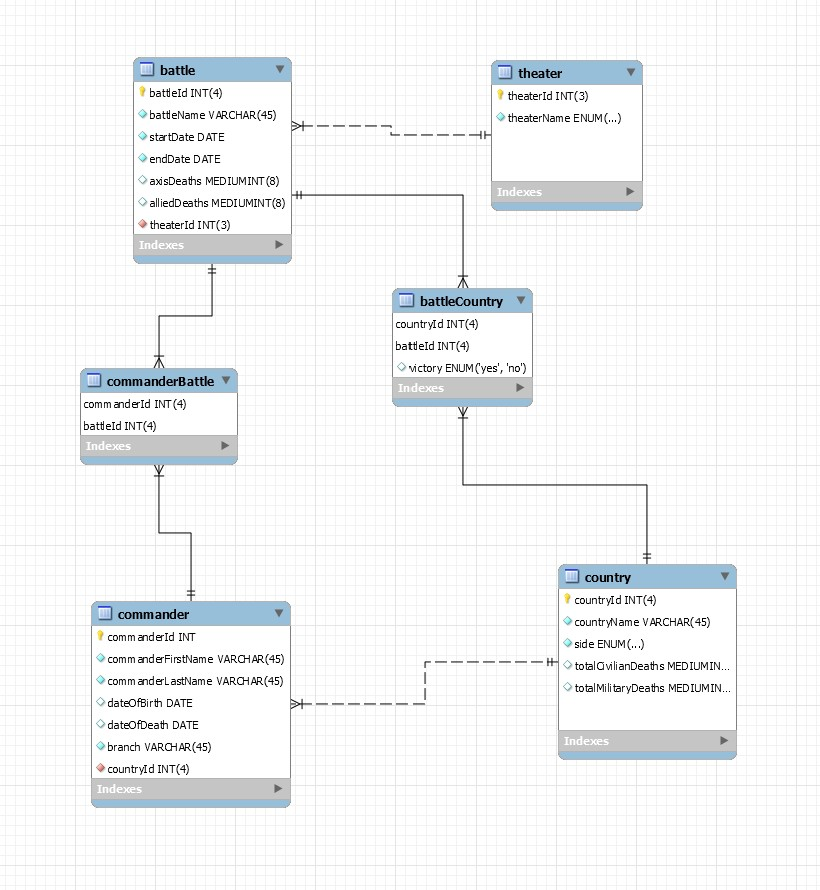

# DBMS

| D    | B    | M          | S      |
| ---- | ---- | ---------- | ------ |
| Data | Base | Management | System |

---

### What is it?

A DBMS is a architecture of stored data that allows easy access and manipulation of data.

---

### Permissions

There are three different types of users in a DBMS:

1. Administrator 
2. Designer
3. End User

---

### Schemas

A schema is a *blueprint*, or *skeleton* of a database layout. This includes the table names, columns and fields.

Example:

---

### Keys

**Keys** enable the **relational** aspect in a DBMS.

There are three different types of keys:

1. Primary Key
2. Foreign Key
3. Composite Key

A **primary key** is a unique value that is used to identify a field within a table. A table can only have ONE primary key. 

A **foreign key** is a reference to primary key.

A **composite key** references two different primary keys from two different tables. 

---

### Relationships

There are three different **Relationships**:

1. 1:1 (one-to-one)
2. M:N (Many-to-many)
3. 1:M (one-to-many)
  
A **one-to-one** is more uncommon than the others. This occurs when there a table that can only have one reference to another table. Pretend for a moment that you can only legally own one vehicle. That vehicle also can only have one owner. That is a one to one relationship. 

A **many-to-many** relationship example: A student can be enrolled in many courses, and that course has many students. 

**One-to-many** relationship example: A book can only have one author, but an author can have many books.

