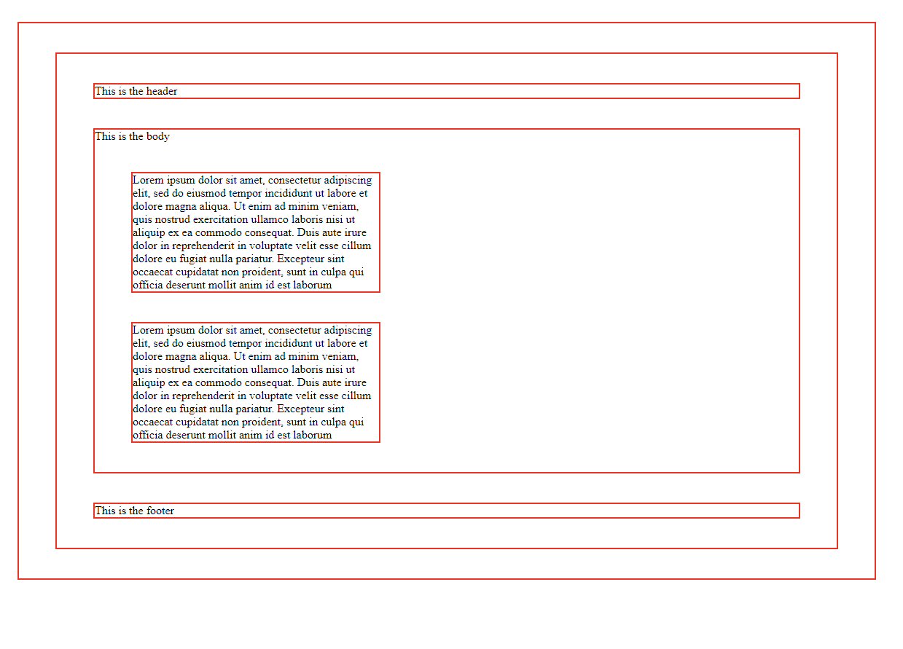

---

### Text 

**Structural Markup** refers to the  elements that are used to describe headings and paragraphs. Below are different structural markup tags. 

**Semantic Markup** places specific emphasis on different pieces of content. 

| Element    | Description       | Example                                 | Markup Type |
| ---------- | ----------------- | --------------------------------------- | ----------- |
| ``    | superscript       | 4th of July                  | Structural  |
| ``    | subscript         | H2O                          | Structural  |
| ` `   | line break        | Hello World!                       | Structural  |
| `
`     | horizontal line   | 
                                  | Structural  |
| `<strong>` | strong content    | <strong>Caution:</strong> Falling Rocks | Semantic    |
| `<q>`      | quote             | <q>To be or not to be</q>               | Semantic    |
| `<cite>`   | cite a source     | <cite>Time Magazine</cite>              | Semantic    |
| `<del>`    | crossout a word   | <del>smoking</del>                      | Semantic    |
| `<ins>`    | insert a new word | <ins>no-smoking</ins>                   | Semantic    |

---

### CSS, Cascading | Style | Sheets 

CSS is used to control the look and design of a webpage. To understand how CSS works, we need to think of HTML in a specific manner. Imagine that all the elements within the page are inside boxes. CSS allows us to target each individual box and represent them in different ways. We can shift the boxes up, left, right or down. We can change the background color for each box as well as the size of the text within each box. There is much more that can be done to every box that will be covered later. 

CSS **rules** consist of two mains parts, the **Selector** and the **declaration**. Each declaration consists of a **Property** and a **Value**. The selector chooses which HTML element to target, while the declaration is what actually changes the HTML element. The property within the declaration indicates which aspect of the element to change while the value is the actual value of that aspect. 

`header {`
`background-color: blue;`
`}`

`p {`
`font-family: Arial;`
`}`

| Selector | Declaration                   |
| -------- | ----------------------------- |
| `header` | `{ background-color: blue; }` |
| `p`      | `{ font-family: Arial; }`     |

 | Property            | Value    |
 | ------------------- | -------- |
 | `background-color:` | `blue;`  |
 | `font-family:`      | `Arial;` |

 ---

 ### Intro to JavaScript 

 As mentioned in the "class-01.md", a script is a set of instructions that a computer must follow in order to carry out a command. Each step of the instructions is known as a **statement**. Each statement must end with a semicolon in order for the next statement to be executed. 

 `var name = "andrew";`

A **variable** is a way to store information temporarily for later use. The statement above is an example of a variable `name` that holds the string value of `"andrew"`. 

 An **array** is a variable that holds a list of values. Arrays are useful for grouping together related items, such as shopping cart items or 

 `var fruit = ['Apple', 'Banana', 'Kiwi', 'Pear', 'Orange'];`

 Each item on this list has a **index**, or position, within the array. The first item, `Apple`, has a index of 0, and `Orange` has an index of 4. `fruit[2] = "Lemon";` will change `Kiwi` to the new value of `"Lemon"`. 

**Decisions and Loops**

Decisions are made up of two sections:

1. An expression that is evaluated and returns a value. 
2. A conditional statement that is executed.

When evaluated expressions, there are eight different comparison operators that are used. 

| Operator | Meaning                  |
| -------- | ------------------------ |
| `==`     | is equal to              |
| `!=`     | is not equal to          |
| `===`    | strict equal to          |
| `!==`    | strict not equal to      |
| `>`      | greater than             |
| `<`      | less than                |
| `>=`     | greater than or equal to |
| `<=`     | less than or equal to    |

What is the difference between equal to and strict equal to? The equal to `==` only checks to see if the values are the same. *ig* `('3' == 3)` would equate to true. Strict equal to `===` on the other hand checks to see if the value AND the data type are the same, so the above expression would be false since it is comparing a string and a number. 

### Writing a git commit message 

When committing a file, it is important to include a **commit message** that briefly explains what changes are being pushed up to Github. When writing a commit message, following these seven rules written by Chris Beams in *How to Write Git Commit Message*:

> 1. Separate subject from body with a blank line
> 2. Limit the subject line to 50 characters
> 3. Capitalize the subject line
> 4. Do not end the subject line with a period
> 5. Use the imperative mood in the subject line
> 6. Wrap the body at 72 characters
> 7. Use the body to explain what and why vs. how
